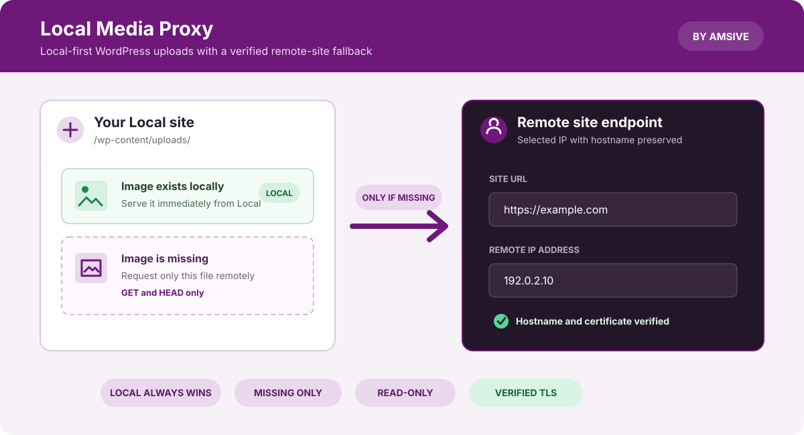

# Local Media Proxy

Local Media Proxy is an [Amsive](https://www.amsive.com/?utm_source=github&utm_medium=referral&utm_campaign=local_media_proxy&utm_content=readme) add-on for [Local](https://localwp.com/) that keeps WordPress uploads out of local clones without breaking image-heavy pages. Existing uploads remain local; only missing images below `/wp-content/uploads/` fall back to a configured production, staging, or development site.

Local Media Proxy is open-source, community-supported software released under the [Apache License 2.0](LICENSE).




## Features

- Enables the fallback independently for each Local site.
- Supports Local sites using Nginx or Apache.
- Auto-populates connected WP Engine environments and supports manual configuration for other hosts.
- Uses public DNS suggestions for Nginx only when provider-specific discovery is unavailable.
- Proxies only missing image requests, allows only `GET` and `HEAD`, and forwards no request body, cookies, or credentials.
- Verifies HTTPS identity and certificate chains against standard public roots and Cloudflare's published Origin CA roots.
- Applies bounded, reversible managed configuration and removes it when the proxy is disabled.

## Requirements

- Local 10.1.1 or newer
- A Local site using Nginx or Apache
- A standard WordPress uploads path at `/wp-content/uploads/`
- Network access to the configured remote endpoint
- For Apache HTTPS, a Local Apache bundle that includes `mod_ssl`

The current official Intel macOS +11 Apache bundle does not include `mod_ssl`, so that specific bundle supports HTTP origins only. Compatible Apple silicon macOS, Linux, and Windows bundles retain Apache HTTPS support.

## Install

1. Download `local-media-proxy-v<version>.tgz` and its optional `.tgz.sha256` file from the matching [GitHub release](https://github.com/amsive/local-media-proxy/releases).
2. In Local, open **Add-ons → Installed**.
3. Choose **Install from disk** and select the `.tgz` directly without extracting it.
4. Enable the add-on and restart Local if prompted.

Local cannot overwrite an installed add-on with the same slug. To update manually, first disable and remove the existing Local Media Proxy installation.

## Configure a site

1. Select a site in Local and open **Tools → Media Proxy**.
2. Choose a connection:
   - **WP Engine:** Select the connected environment and choose **Auto-populate from WP Engine**.
   - **Flywheel or another host:** Enter a Site URL manually. For Nginx, also enter a trusted remote IP or use **Find via public DNS**.
   - **Apache:** Enter the Site URL. Apache resolves that hostname directly and does not use a separate remote IP.
3. Choose **Test connection**. HTTPS checks verify both the certificate chain and expected identity.
4. Choose **Save & apply**, then turn on **Enable for this site**.
5. Load an image that is absent locally. A successful fallback returns `200` with `X-Local-Media-Proxy: origin`.

Enter only a URL scheme and hostname plus an optional port, such as `https://example.com`. Do not include credentials, paths, query strings, or fragments. Discovered values are suggestions and are never saved or enabled without an explicit action.

## How it works

```text
Browser requests /wp-content/uploads/.../image.png
             |
             v
       File exists locally? ---- yes ---> serve local file
             |
             no
             v
Verified remote endpoint ---> stream image response
```

Nginx can connect to a selected IP while preserving the Site URL as the HTTP `Host`. Guarded WP Engine discovery may also preserve a provider-returned direct hostname for TLS verification. Apache uses one validated Site URL hostname for DNS, `Host`, TLS SNI, and certificate identity.

The add-on does not proxy PDFs, video, audio, themes, plugins, APIs, arbitrary missing URLs, or non-upload paths. It streams responses without a persistent media cache.

## HTTPS and Cloudflare Origin CA

HTTPS is verified against Node's standard certificate authorities plus Cloudflare's published RSA and ECC Origin CA roots. The two Cloudflare fingerprints and the bundled PEM hash are pinned by automated release checks.

This supports sites that correctly present Cloudflare Origin Certificates without trusting arbitrary self-signed certificates. Hostname mismatches, expired certificates, invalid chains, and unrecognized self-signed certificates remain rejected. There is no certificate-verification bypass or runtime CA download.

See [Technical details](docs/technical-details.md) for the full Nginx/Apache identity model, request filtering, managed files, rollback behavior, Local lifecycle integration, and troubleshooting.

## Development

```bash
npm install
npm run verify:public-release
npm run verify:third-party
npm run validate
npm run package:addon
```

The release installer uses npm's single `package/` root and contains exactly 25 reviewed runtime files. Source, tests, source maps, dependencies, and repository-only process documents are excluded.

See [CONTRIBUTING.md](CONTRIBUTING.md) for development and DCO requirements, [PUBLIC_RELEASE_SAFETY.md](PUBLIC_RELEASE_SAFETY.md) for the blocking public-content review, and [RELEASING.md](RELEASING.md) for the draft and promotion workflow.

## Support, security, and conduct

- Use the project-specific [issue forms](https://github.com/amsive/local-media-proxy/issues/new/choose) for reproducible bugs and focused feature requests.
- Read [SUPPORT.md](SUPPORT.md) for the best-effort community support policy.
- Report suspected vulnerabilities privately through [SECURITY.md](SECURITY.md).
- Community participation is governed by [CODE_OF_CONDUCT.md](CODE_OF_CONDUCT.md).

Do not submit client information, production domains or addresses, credentials, cookies, private certificates, proprietary code, or material you are not authorized to contribute.

## License and third-party material

Copyright © 2026 Amsive LLC.

Amsive-authored source and packaged files are distributed under the [Apache License 2.0](LICENSE). Third-party material and applicable terms are identified in [NOTICE](NOTICE) and [the provenance record](docs/third-party-provenance.md). The software is provided on an **as-is** basis without warranties or conditions of any kind.

The Apache license does not grant rights to use Amsive trademarks beyond customary attribution; see [TRADEMARKS.md](TRADEMARKS.md). References to Local, WP Engine, Flywheel, WordPress, Cloudflare, and other products describe compatibility and do not imply sponsorship or endorsement.

Maintained by Amsive LLC. Developed by Mark Davoli and Boris Hegedis.
